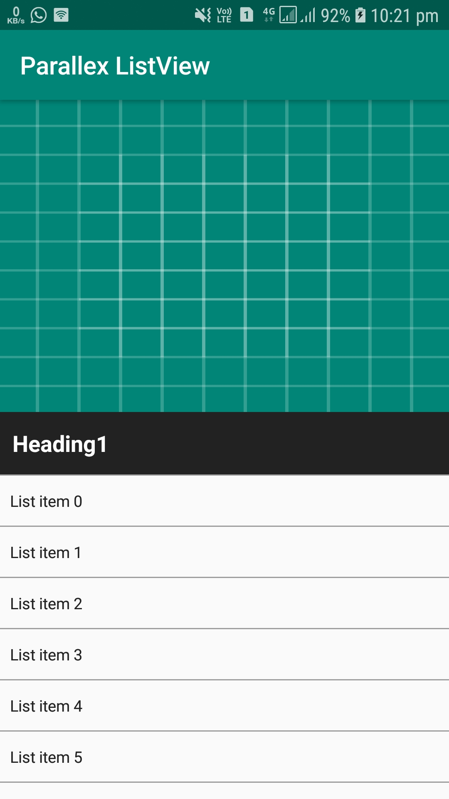
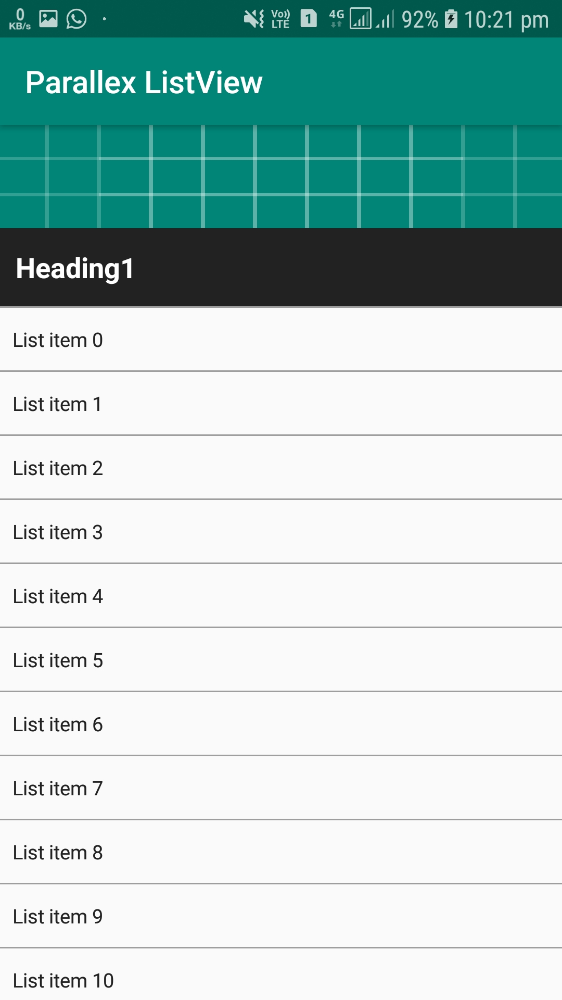
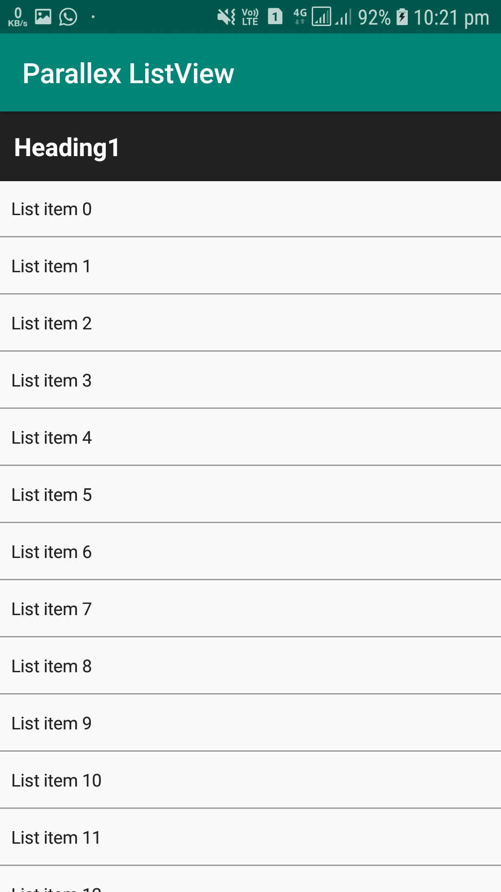

# ListView Header Parallax with Sticky View in Android

Build a ListView Parallax Effect With a Sticky Header in Android 

A quick Android example with code snippet to demonstrate `ListView` parallax effect with sticky header. In our previous tutorial, we saw `Creating ListView Header Parallax Animation`, now in this example we will go little further and make the list header parallax animation with an view stick to top when list is scrolled.

You need to follow the following steps as described below to create the list view parallax effect :

* Declare Activity Layout
* Declare List Header Layout
* Declare List Row Layout
* Handle ListView Scroll Events

The output of this example in the following attached video :

## YouTube [demo :](https://www.youtube.com/watch?v=eyWDkwVnYxo)

[](https://www.youtube.com/watch?v=eyWDkwVnYxo)

## Screenshots :

<div style="display:flex;">



</div>

## 1. Declare Activity Layout

To begin with let us start declaring your activity layout. It is a bit tricky. Let us take an frame layout that hosts the hero image, sticky view and a ListView.

```xml
<FrameLayout xmlns:android="http://schemas.android.com/apk/res/android"
             xmlns:app="http://schemas.android.com/apk/res-auto"
             xmlns:tools="http://schemas.android.com/tools"
             android:layout_width="match_parent"
             android:layout_height="match_parent"
             tools:context=".ParallexActivity">

    <ImageView
            android:id="@+id/heroImageView"
            android:layout_width="match_parent"
            android:layout_height="250dp"
            android:background="@drawable/ic_launcher_background"
            android:scaleType="fitCenter"/>

    <ListView
            android:id="@+id/listView"
            android:layout_width="match_parent"
            android:layout_height="wrap_content"
            android:divider="#9E9E9E"
            android:dividerHeight="1dp"
            android:scrollbars="none"/>

    <TextView
            android:id="@+id/stickyView"
            android:layout_width="match_parent"
            android:layout_height="50dp"
            android:background="#222"
            android:gravity="center_vertical"
            android:paddingLeft="10dp"
            android:text="Heading1"
            android:textColor="#fff"
            android:textSize="20sp"
            android:textStyle="bold"/>
</FrameLayout>
```

## 2. Declare List Header Layout

Now declare the layout for list header. In this example, I have declared an ImageView inside FrameLayout. The header view is declared as follows.

```xml
<?xml version="1.0" encoding="utf-8"?>
<LinearLayout xmlns:android="http://schemas.android.com/apk/res/android"
    android:layout_width="match_parent"
    android:layout_height="match_parent"
    android:orientation="vertical">

    <Space
        android:layout_width="match_parent"
        android:layout_height="250dp" />

    <Space
        android:id="@+id/stickyViewPlaceholder"
        android:layout_width="match_parent"
        android:layout_height="50dp" />

</LinearLayout>
```
Notice that in the above header layout,

* We have declared Space objects. Android Space widget is subclass of View, used to occupy invisible, transparent space on the screen. You cannot apply any style, such as color, background etc.
* The height of both Space objects are same as the height of hero image and sticky widget as declared in your activity layout.
* These two invisible views will be useful to calculate the view position and will help to create the parallel effect.


## 3. Declare List Row Layout

Declare another layout for your list view row. In this example, for sake of simplicity I have declared a simple `TextView`. You may design fancy list of your choice by declaring your own custom adapter.

```xml
<?xml version="1.0" encoding="utf-8"?>
<TextView xmlns:android="http://schemas.android.com/apk/res/android"
    android:layout_width="fill_parent"
    android:layout_height="wrap_content"
    android:background="#FAFAFA"
    android:gravity="center_vertical"
    android:minHeight="40dp"
    android:padding="8dp"
    android:textColor="#222" />
```

## 4. Handle ListView Scroll Events

Following step will guide you with the necessary things required in your activity to create list view, add list header and implement parallax effect.

* Implement setOnScrollListener for your list view to handle the user scroll event.
* Calculate the position of the sticky header view according to the position of the first item in the ListView.
* When the first item is already reached to top, you don’t need to re-position the sticky header view.
* Set the hero image to scroll half of the amount that of ListView

```kotlin
package com.zeph7.javaparralexlistview

import android.content.Context
import android.support.v7.app.AppCompatActivity
import android.os.Bundle
import android.view.LayoutInflater
import android.view.View
import android.widget.AbsListView
import android.widget.ArrayAdapter
import android.widget.ListView
import android.widget.TextView
import java.util.ArrayList

class  ParallexActivity : AppCompatActivity() {

    private var stickyView: TextView? = null
    private var listView: ListView? = null
    private var heroImageView: View? = null
    private var stickyViewSpacer: View? = null
    private val MAX_ROWS = 20

    override fun onCreate(savedInstanceState: Bundle?) {
        super.onCreate(savedInstanceState)
        setContentView(R.layout.activity_main)

        /* Initialise list view, hero image, and sticky view */
        listView = findViewById(R.id.listView) as ListView
        heroImageView = findViewById(R.id.heroImageView)
        stickyView = findViewById(R.id.stickyView) as TextView

        /* Inflate list header layout */
        val inflater = getSystemService(Context.LAYOUT_INFLATER_SERVICE) as LayoutInflater
        val listHeader = inflater.inflate(R.layout.list_header, null)
        stickyViewSpacer = listHeader.findViewById(R.id.stickyViewPlaceholder)

        /* Add list view header */
        listView!!.addHeaderView(listHeader)

        /* Handle list View scroll events */
        listView!!.setOnScrollListener(object : AbsListView.OnScrollListener {

            override fun onScrollStateChanged(view: AbsListView, scrollState: Int) {}

            override fun onScroll(
                view: AbsListView,
                firstVisibleItem: Int,
                visibleItemCount: Int,
                totalItemCount: Int
            ) {

                /* Check if the first item is already reached to top.*/
                if (listView!!.firstVisiblePosition == 0) {
                    val firstChild = listView!!.getChildAt(0)
                    var topY = 0
                    if (firstChild != null) {
                        topY = firstChild.top
                    }

                    val heroTopY = stickyViewSpacer!!.top
                    stickyView!!.y = Math.max(0, heroTopY + topY).toFloat()

                    /* Set the image to scroll half of the amount that of ListView */
                    heroImageView!!.y = topY * 0.5f
                }
            }
        })


        /* Populate the ListView with sample data */
        val modelList = ArrayList<String>()
        for (i in 0 until MAX_ROWS) {
            modelList.add("List item $i")
        }

        val adapter = ArrayAdapter(this, R.layout.list_row, modelList)
        listView!!.adapter = adapter
    }
}
```

# Licence

Licenced under the [MIT Licence](https://github.com/ashish7zeph/android-kotlin-Parallax-listview/blob/master/LICENSE)

